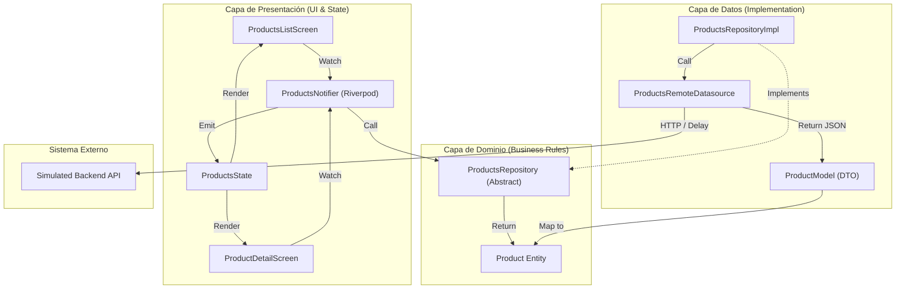
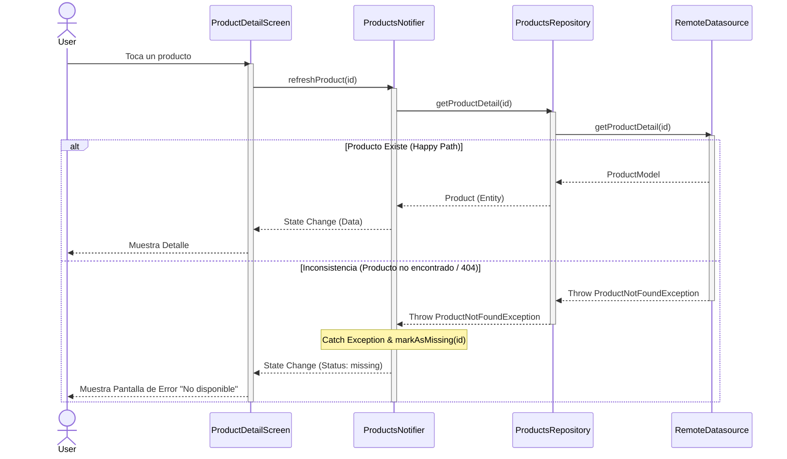

# Flutter Marketplace App 🛍️

Aplicación robusta de marketplace en Flutter desarrollada para una prueba técnica.

-> arquitectura escalable 
-> patrones de gestión de estado 
-> implementación de UI.

## 🚀 Funcionalidades

### **Feature 1: Marketplace de Productos**
- **Carga de Datos Asíncrona:** Obtiene productos de un datasource remoto simulado (con latencia de red y simulación de errores).
- **Manejo de Datos Inconsistentes:** Maneja productos faltantes, precios desactualizados y errores 404 en las vistas de detalle.
- **UI:** Diseño de cuadrícula estilo Amazon con búsqueda (simulada), calificaciones y badges de estado.
- **Arquitectura:** Capas de Clean Architecture (Dominio, Datos, Presentación).

### **Feature 2: Perfil de Usuario**
- **UI Optimista:** Actualizaciones instantáneas en la UI mientras se guarda en segundo plano.
- **Resolución de Conflictos:** Simula "conflictos de guardado" (30% de probabilidad) y proporciona un mecanismo para **Descartar** o **Reintentar** los cambios.
- **Componentes:** UI modular con `ProfileMenuTile` y `ProfileSnackBar` reutilizables.
- **Tema:** Cambio de modo Oscuro/Claro con persistencia instantánea en el estado de la app.

### **Utilidades Core**
- **Formateo de Moneda:** Formateador personalizado que refleja estándares chilenos/internacionales (ej., `$ 125.000 USD`).
- **Theming:** `AppTheme` centralizado con soporte para ColorScheme - ThemeDark y ThemeLight.
- **Robustez de Datos:** Sistema de serialización "Blindado" (`RobustStringConverter`, `RobustDoubleConverter`) que evita crasheos por datos inconsistentes (nulls, tipos erróneos) con impacto de rendimiento despreciable (0.24µs por item).

---

## 📊 Diagramas Técnicos

### **1. Arquitectura & Componentes**
Estructura de Clean Architecture + Riverpod.



### **2. Diagrama de Secuencia: Flujo de Detalle e Inconsistencia**
Muestra cómo se manejan los errores de consistencia (producto "missing" o 404).



---

## 🏗️ Arquitectura

El proyecto sigue **Clean Architecture** combinada con **Riverpod 2.0 (Generator)**.

### **Estructura de Carpetas**
```
lib/
├── core/               # Lógica compartida (Errores, Tema, Utils)
├── features/           # Módulos por funcionalidad (Feature-first)
│   ├── products/
│   │   ├── data/       # Implementación de Repositorios y Datasources
│   │   ├── domain/     # Entidades e Interfaces de Repositorios
│   │   └── presentation/ # Pantallas, Providers (Notifiers), Widgets
│   └── profile/        # (Misma estructura)
├── shared/             # Componentes UI reutilizables y Tema
└── main.dart           # Punto de entrada de la App
```

### **Gestión de Estado: Riverpod**
- **Notifiers:** `StateNotifier` configura la lógica para gestionar estados complejos (`ProductsState`, `ProfileEditState`).
- **AsyncValue:** Se usa intensivamente para manejar correctamente los estados de Carga/Error/Data en la UI.
- **Inyección de Dependencias:** Los repositorios se inyectan en los Notifiers a través de providers de Riverpod.

---

## 🛠️ Configuración y Ejecución

1.  **Prerrequisitos:** Flutter SDK instalado.
2.  **Dependencias:**
    ```bash
    flutter pub get
    ```
3.  **Generación de Código (Freezed/Riverpod):**
    > Nota: Este proyecto usa generación de código. Si cambias modelos o providers, ejecuta:
    ```bash
    dart run build_runner build --delete-conflicting-outputs
    ```
4.  **Ejecutar App:**
    ```bash
    flutter run
    ```
5.  **Ejecutar Tests:**
    ```bash
    flutter test
    ```

## 🧪 Testing

- **Unit Tests:** Ubicados en `test/features/`. Cubren la lógica de los Repositorios y Modelos.
- **Robustness Tests:** `product_model_test.dart` verifica la resiliencia ante datos corruptos.
- **Benchmarks:** `performance_benchmark_test.dart` mide el impacto del parsing (Clean vs Dirty Data).
- **Widget Tests:** Cubren el renderizado de la UI e interacciones (En progreso).

---

Desarrollado por Bastian Valencia. 
